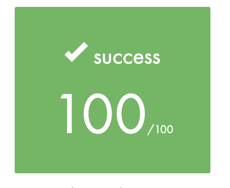

# lem-in

## Elementary algorithmic project

Description : 
Votre colonie de fourmis doit se déplacer d'un point à un autre. Mais comment faire pour que cela prenne le moins de temps possible ? Ce projet vous fait découvrir les algorithmes de parcours de graphe : votre programme devra sélectionner intelligemment les chemins et les mouvements précis qui doivent être empruntés par ces fourmis.

-----

* Objectives :
    * Parcours de graphe
    * Algorithmes en profondeur

-----

* Skills :
    * Rigor
    * Algorithms & AI
    * Imperative programming

-----

